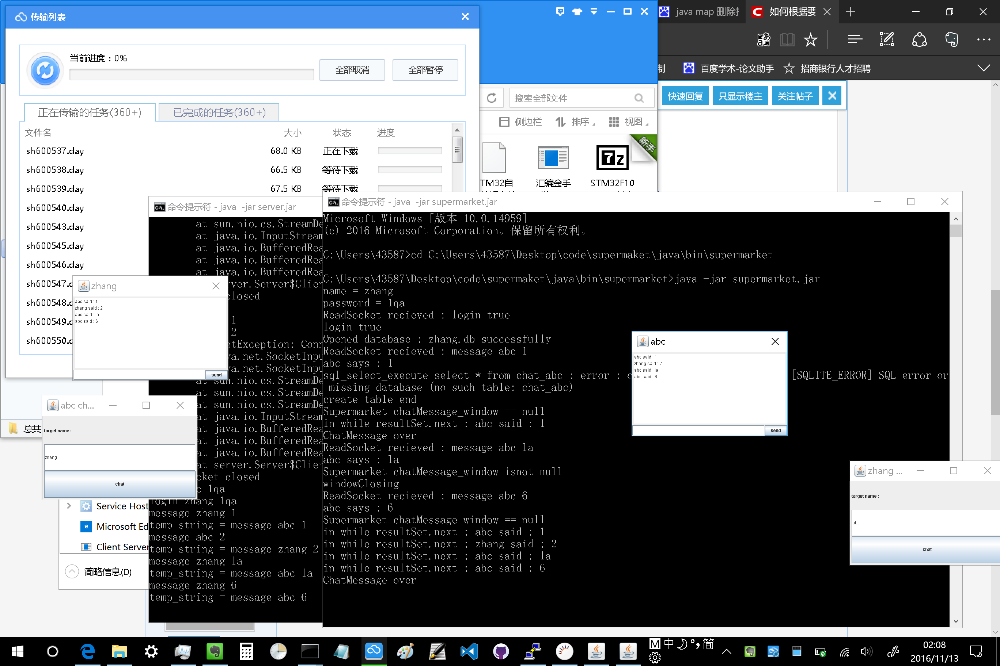

# supermaket
## 完成了：
1.聊天功能

2.新来消息，聊天窗口自动跳出

3.聊天窗口自动读取历史消息

4.主界面退出，其余窗口自动全部退出

-------------------------------
## 注意事项：
1.因为时间不够，所以主界面没有做从服务器拉取好友列表并显示的功能，
直接用填写目标名称来实现；
同时因为没有好友列表，所以也没做改变头像表示上下线状态。

2.src文件夹下的test.db是放在服务器端的，保存用户名和密码的；
剩下的.db都是放在客户端的，但理论上会自动生成，故请不要用。

3.src文件夹里的.jar都是之前版本的，忘记删初了的，故请不要使用；
所有.jar都应自己生成，并放在bin文件夹里执行。

